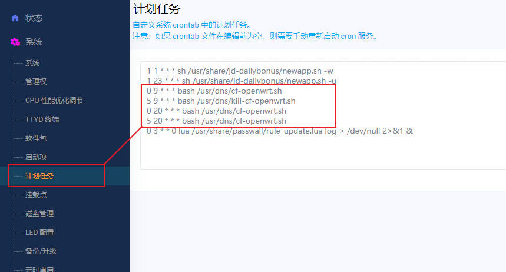

# 路由器优选IP脚本设置定时更换优选ip
* 用ssh连接软件连接opewrt
```Bash
# 进入usr文件夹
cd /usr

# 如果是第一次使用，则建议创建新文件夹（后续更新请跳过该步骤）
mkdir dns

# 进入文件夹（后续更新，只需要从这里重复下面的下载）
cd dns

# 下载 cf-openwrt
wget https://raw.githubusercontent.com/Lbingyi/cf-autoupdate/main/cf-openwrt.sh
```
#### 修改cf-openwrt.sh中的两处地方
* bandwidth 处是带宽选择

* 一处是微信/Telegram推送token


* 0代表分9代表小时，意思是9：00整开始运行脚本
```Bash

0 9 * * * bash /usr/cloudflare/cf-openwrt.sh
0 20 * * * bash /usr/cloudflare/cf-openwrt.sh
```
* 添加计划任务
* 依次进入 系统-计划任务
* 添加一下命令



* 到这里就完成全部操作了，然后就是等待自动执行。
* 当然，我们可以手动来执行一次，执行命令：
```Bash
bash /usr/cloudflare/cf-openwrt.sh
```

## 修改于better-cloudflare-ip
* 请参考 [better-cloudflare-ip](https://github.com/badafans/better-cloudflare-ip)
